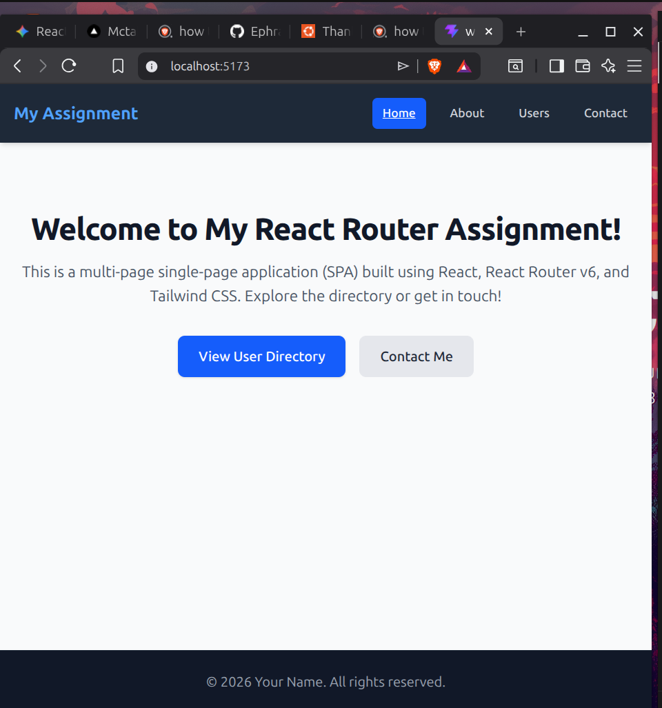

# Week 4 Day 4 Assignment: Multi-Page React Router App

A complete, responsive single-page application (SPA) built using **React**, **React Router v6**, and **Tailwind CSS v4** (via `@tailwindcss/vite`). This project demonstrates client-side routing, layout sharing via `<Outlet />`, dynamic routing via URL parameters, form handling with validation state, and URL search parameter synchronization.

---

## 📸 Home Screen Preview

Here is a screenshot of the completed landing page layout:




## 🚀 How to Run the Project Locally

Follow these steps to set up and start the local development server:

1. **Install Dependencies** (Run this inside the project root folder):
   ```bash
   npm install

## 📂 Core Assignment Tasks Implemented
📝 Task 1: Multi-Page App with React Router
Set up a clean routing tree using <BrowserRouter>, <Routes>, and <Route>.

Implemented a standard nested master framing configuration using an <Outlet /> inside Layout.jsx.

Shared a common structural NavBar and Footer component across all page endpoints.

Added dynamic active style detection on menu options using the NavLink component.

Built a standalone custom 404 NotFound route equipped with code-driven useNavigate() redirection paths.

## 👥 Task 2: Dynamic User Directory Routes
Fetches user data asynchronously from the external JSONPlaceholder API mock endpoint.

Handled component initialization states safely via explicit loading checks.

Constructed dynamic routing parameters under the /users/:id endpoint.

Used the useParams() hook to capture selected user identifiers and execute secondary API details retrieval.

## ✉️ Task 3: Styled Contact Form & Validation
Built a completely responsive input card structure using Tailwind utility classes (w-full md:w-1/2).

Handled multi-input field states natively using a single unified state handler object.

Attached live client-side string verification expressions to block form submissions on formatting errors.

Implemented visual form states by conditionally changing border variables (red on errors, green on success) and flushing input text state parameters clean upon execution.

## 🔍 Bonus Challenge: URL Search Parameter Synchronizer
Hooked up query inputs inside a standalone search route using the useSearchParams() hook.

Automatically synchronized input string parameters directly to the window address bar parameters (/search?q=text).

Ensured search parameters remain preserved, keeping filtered results accurate on page updates or link shares.

## 🛠️ Technology Summary Stack
Vite — High-performance frontend tool bundler framework.

React 18 — Component-driven application layer model architecture.

React Router v6 — Single-page application network route synchronization management library.

Tailwind CSS v4 — Declarative inline atomic styling utilities.